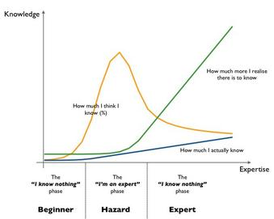

# Quotes

This page lists quotes from various sources on software development and related topics.

## Sections

- [Knowledge](#knowledge)
- [Design](#design)
- [Miscellaneous](#miscellaneous)
- [Goals](#goals)
- [Empathy](#empathy)
- [Priorities](#priorities)
- [Continous Learning](#continous-learning)
- [Team Work](#team-work)
- [Communication](#communication)

### Knowledge

"If you can't explain it simply, you don't understand it well enough." - [Attributed to Albert Einstein](https://skeptics.stackexchange.com/questions/8742/did-einstein-say-if-you-cant-explain-it-simply-you-dont-understand-it-well-en)

"As our circle of knowledge expands, so does the circumference of darkness surrounding it." - [Attributed to Albert Einstein](https://www.goodreads.com/quotes/143906-as-our-circle-of-knowledge-expands-so-does-the-circumference)

"You can't think of everything." - [Stephen Hawking, commenting on why Isaac Newton didn't figure out how to stabilize the solar system, in response to a question from Neil Degrasse Tyson (from A Conversation with Astrophysicist J. Richard Gott III at 26:36)](https://www.youtube.com/watch?v=VFmHSnnI0OA&t=1596s)

"The greatest enemy of knowledge is not ignorance, it is the illusion of knowledge." - [Daniel J. Boorstin](https://quoteinvestigator.com/2016/07/20/knowledge/)

Context and experience matter a lot when making decisions. - [Relevant Article](https://hbr.org/2020/01/the-elements-of-good-judgment)

"Everything you need to know about Knowledge and Expertise in one handy graph." - [Simon Wardley](https://x.com/swardley/status/526074463175966720)

"At some point, the learning stops and the pain begins." - Attributed to S. Rao Kosaraju, Johns Hopkins University

### Design

"If I were given an hour in which to do a problem upon which my life depended, I would spend 40 minutes studying it, 15 minutes reviewing it and 5 minutes solving it." - [Attributed to Albert Einstein](https://quoteinvestigator.com/2014/05/22/solve/)

"Simple things should be simple and complex things should be possible." - [Alan Kay](https://www.quora.com/What-is-the-story-behind-Alan-Kay-s-adage-Simple-things-should-be-simple-complex-things-should-be-possible)

"Program to an interface, not an implementation." - [Gang of Four](https://en.wikipedia.org/wiki/Design_Patterns#Introduction)

"We should forget about small efficiencies, say about 97% of the time: premature optimization is the root of all evil. Yet we should not pass up our opportunities in that critical 3%." - [Donald Knuth](https://en.wikipedia.org/wiki/Program_optimization)

"There are no solutions. There are only trade-offs." - [Thomas Sowell](https://www.goodreads.com/quotes/1411380-there-are-no-solutions-there-are-only-trade-offs)

"Don't reinvent the wheel; just realign it." - [Popularized by Anthony D'Angelo](https://en.wikipedia.org/wiki/Reinventing_the_wheel)

"Triggering a fault opens the crack. Faults become errors, and errors provoke failures. That's how the cracks propogate." - [Release it! Page 29](https://pragprog.com/titles/mnee2/release-it-second-edition/)

"Cleverness of code is proportional to the confusion it creates." - [Venkat Subramaniam](https://x.com/venkat_s/status/1518006880844632066)

"If estimation is guessing, requirements are rumors." - Dave Thomas

"The architecture should tread the line between underspecifying and overspecifying the sysetm." - [Code Complete 2 page 53](https://www.microsoftpressstore.com/store/code-complete-9780735619678)

"With building it's clear that it's unreasonable for clients to ask for a bid before telling you what you're going to build. Your clients wouldn't want you to show up with wood, hammer, and nails and start spending their money before the architect had finished the blueprints. People tend to understand software development less than they understand two-by-fours and sheetrock, however, so the clients you work with might not immediately understand why you want to plan requirements development as a separate project. You might need to explain your reasoning to them." - [Code Complete 2 page 56](https://www.microsoftpressstore.com/store/code-complete-9780735619678)

Four rules of simple design:

- Passes the tests
- Reveals intention
- No duplication
- Fewest elements

- [Beck Design Rules](https://martinfowler.com/bliki/BeckDesignRules.html)

"Barry Boehm reported that information hiding was a powerful technique for eliminating rework, and he pointed out that it was particularly effective in incremental, high-change environments (Boehm 1987)." - [Code Complete 2 page 92](https://www.microsoftpressstore.com/store/code-complete-9780735619678)

### Miscellaneous

The Peter Principle is an observation that people in a hierarchy tend to rise to 'a level of respective incompetence'. It's important to have self reflection on your progress and abilities. - [Peter principle](https://en.wikipedia.org/wiki/Peter_principle)

The Dunning–Kruger effect is a cognitive bias in which people with limited competence in a particular domain overestimate their abilities. - [Dunning–Kruger effect](https://en.wikipedia.org/wiki/Dunning%E2%80%93Kruger_effect)

The Pot Roast Principle is an example of how we should review routines and traditions and determine if there are better ways to do things. Don't just follow the same path because that's how it's always been. - [An example of the Pot Roast Story – A Leadership Tale](https://drmarjorieblum.com/2013/08/16/the-pot-roast-story-a-leadership-tale/)

"Engineer (noun). 1. A person who does precision guess-work based on unreliable data provided by those of questionable knowledge." - Anonymous

"We do these things not because they are easy, but because we thought they were going to be easy." - [The Programmers’ Credo](https://www.reddit.com/r/ProgrammerHumor/comments/etboii/the_programmers_credo/)

"The amount of energy needed to refute bullshit is an order of magnitude bigger than that needed to produce it." - [Alberto Brandolini](https://en.wikipedia.org/wiki/Brandolini%27s_law)

"The problem with common sense is that it's not so common" - [Misquote of Voltaire](https://www.brainyquote.com/quotes/voltaire_106180)

"With great power comes great responsibility." - [Uncle Ben](https://en.wikipedia.org/wiki/With_great_power_comes_great_responsibility)

"Later equals never." - [LeBlanc's Law](https://yiming.dev/clipping/2019/03/21/le-blanc%27s-law-a-k-a-later-equals-never/)

"You are the average of the five people you spend the most time with." - [Attributed to Jim Rohn](https://builtonpurposehq.com/blog/the-average-of-the-five-around-you)

"Plans are useless, but planning is indispensable." - [Dwight D. Eisenhower](https://quoteinvestigator.com/2017/11/18/planning/)

"A delayed game is eventually good, but a rushed game is forever bad." - [Attributed to Shigeru Miyamoto](https://www.acriticalhit.com/solved-miyamoto-quote-late-game-bad-forever/)

"Computing is the only profession in which a single mind is obliged to span the distance from a bit to a few hundred megabytes, a ratio of 1 to 10^9, or nine orders of magnitude. 'Compared to that number of semantic levels, the average mathematical theory is almost flat. By evoking the need for deep conceptual hierarchies, the automatic computer confronts us with a radically new intellectual challenge that has no precedent in our history.'" - [Code Complete 2 page 78](https://www.microsoftpressstore.com/store/code-complete-9780735619678)

"Make the change easy, then make the easy change." - [Kent Beck](https://x.com/KentBeck/status/250733358307500032?s=20)

### Goals

"We must travel through the valley of shadows before we can reach the plateau of enlightenment." - [Release it! Page 30](https://pragprog.com/titles/mnee2/release-it-second-edition/)

"The only thing more painful than learning from experience is not learning from experience." - [Lawrence Peter](https://quoteinvestigator.com/2017/05/19/experience/)

"Success is the ability to go from failure to failure without losing your enthusiasm." - [Attributed to Winston Churchill](https://quoteinvestigator.com/2014/06/28/success/)

"Experience is what you get when you didn't get what you wanted." - [Randy Pasch](https://www.youtube.com/watch?v=ji5_MqicxSo)

"Don't break the chain." - [Productivity tip, attributed to comedian Jerry Seinfeld](https://lifehacker.com/jerry-seinfelds-productivity-secret-281626)

What consistency really is, just showing up every day for at least a little bit.  

"Eyes open, no fear." - Brian Holmes

"Dripping water hollows out stone, not through force but through persistence." - [Several People](https://wist.info/other/26191/)

"When nothing seems to help, I go and look at a stonecutter hammering away at his rock perhaps a hundred times without as much as a crack showing in it. Yet at the hundred and first blow it will split in two, and I know it was not that blow that did it, but all that had gone before." - [Jacob Riis](https://www.poundingtherock.com/pages/the-quote)

"Perfect is the enemy of good." - [Perfect is the enemy of good](https://en.wikipedia.org/wiki/Perfect_is_the_enemy_of_good)

"Whether you think you can, or you think you can’t – you’re right." - [Henry Ford](https://www.goodreads.com/quotes/978-whether-you-think-you-can-or-you-think-you-can-t--you-re)

"Never stop. Never stop. You must continue every day improving and working hard." - [Alex González-Urbón's mother on life and making hamburgers](https://youtu.be/3qWzILxqovk?si=27EJhYSrXK7xhU3x&t=2617)

"Embrace growth and believe that maintaining your goals and overcoming challenges will continue to teach you something." - [Rally Coach](https://www.rallyhealth.com/rally-coach)

"Create a SMART goal to ensure your goal is realistic. Use the Goldilocks rule - not too hard, not too easy. Just right." - [Rally Coach](https://www.rallyhealth.com/rally-coach)

"Now, physically, if I can't do it, then I can't do it. But physically, if I can do it and I just don't feel like doing it, that's a whole different lens." - [Michael Jordan](https://x.com/NBAonNBC/status/1983364626726138150?s=20)

### Empathy

"Thinking code looks ridiculous is the best sign I'm misunderstanding something fundamental about the pressures that produced it." - [Sarah Mei](https://x.com/sarahmei/status/595442223170256896)

Give some respect to past decisions and existing code. We don't know what pressures the developers and team were under at the time. Spend some time gaining context. - [Related to Chesterton's fence](https://en.wikipedia.org/wiki/Wikipedia:Chesterton%27s_fence)

"Here’s the thing folks. I’ve been coding 32 years. When something like this happens it’s an organizational failure. Yes, some human wrote a bad line. Someone can “git blame” and point to a human and it’s awful. But it’s the testing, the Cl/CD, the A/B testing, the metered rollouts, an oh shit button to roll it back, the code coverage, the static analysis tools, the code reviews, the organizational health, and on and on. It’s always one line of code but it’s NEVER one person. Implying inclusion policies caused a bug is simplistic, reductive, and racist. 

Engineering is a team sport. Inclusion makes for good teams. Good engineering practices makes for good software. Engineering practices failed to find a bug multiple times, regardless of the seniority of the human who checked that code in. Solving the larger system thinking SDLC matters more than the null pointer check. 

This isn’t a “git gud C++ is hard” issue and it damn well isn’t an DEI one." - [Scott Hanslman on teamwork and blame](https://www.linkedin.com/posts/shanselman_crowdstrike-activity-7220428353269350400-DyM4)

"Always assume the problem is in your code and act accordingly." -
[Jeff Atwood on ownership and responsibility](https://blog.codinghorror.com/the-first-rule-of-programming-its-always-your-fault/)

"Problem exists between chair and keyboard." - [You or someone else may just have a misunderstanding](https://en.wiktionary.org/wiki/PEBCAK)

You have to believe that whatever someone is telling you is what they truly think in order to start understanding their perspective. Even if you don't agree, you just have to realize they believe something else and work to put yourself in their shoes for a moment. Then you can work to change their perspective or your own. - Adam Flater discussing what his father explained to him about communication

"Don't attribute to malice what you can attribute to ignorance." - [Hanlon's Razor](https://en.wikipedia.org/wiki/Hanlon%27s_razor)

“Almost everyone, almost always, is just trying to be helpful.” - Attributed to a Don Gray (?)

"To each their own." - [Latin phrase suum cuique, now used to express that people have different preferences, likes, and dislikes](https://en.wikipedia.org/wiki/Suum_cuique)

"He will win who knows when to fight and when not to fight. (Pick your battles)" - [Sun Tzu](https://www.goodreads.com/quotes/8707883-1-he-will-win-who-knows-when-to-fight-and)

"Every successful person you admire survived a season you didn’t see." - [Leila Hormozi](https://www.linkedin.com/posts/leilahormozi_every-successful-person-you-admire-survived-activity-7297744198814814208-SV3Q)

"Do not dwell in the past, do not dream of the future, concentrate the mind on the present moment." - [Attributed to Gautama Buddha](https://fakebuddhaquotes.com/do-not-dwell-in-the-past-do-not-dream-of-the-future/)

### Priorities

"Change is terrible, unless it's great." - [Jeremy Barton from Framework Design Guidelines](https://a.co/d/9tUIaFr)

"Don't shave that yak!" - [Explained by Seth Godin](https://seths.blog/2005/03/dont_shave_that/)
Sometimes addressing issues is important. To help fix problems or reduce time for the team. It can drive ownership as well but you have to consider if fixing something is worth it or not. [https://medium.com/the-composition/a-taxonomy-of-yak-shaving-102da591308b](https://medium.com/the-composition/a-taxonomy-of-yak-shaving-102da591308b)

"Is the juice worth the squeeze?" - [juice is worth the squeeze](https://en.wiktionary.org/wiki/juice_is_worth_the_squeeze)

The Pickle Jar Theory is one way to organize tasks. Imagine your tasks as rocks, pebbles and sand. Important, time consuming and sensitive tasks would be the rocks, smaller tasks would be pebbles and the sand are things that fill in around those. We only have time for a few big tasks per day (the rocks), with a few smaller tasks (the pebbles) between them surrounded by our normal daily tasks (the sand) which aren't on a strict deadline. 
- [Prioritize Your To-Do List By Imagining Rocks in a Jar](https://lifehacker.com/work/pickle-jar-theory-to-prioritize-tasks)

"The 1-3-5 rule acknowledges that in a typical day, you just don’t have time to do it all. What you do reasonably have time for is one major task, three medium-sized tasks, and five little ones." - [Make a Better To-Do List With the 1-3-5 Method](https://lifehacker.com/work/make-a-better-to-do-list-1-3-5-rule)

### Continous Learning

"To reread at least monthly:

- 'I don’t know' is not an admission of ignorance. It’s an expression of intellectual humility.
- 'I was wrong' is not a confession of failure. It’s a display of intellectual integrity.
- 'I don’t understand' is not a sign of stupidity. It’s a catalyst for intellectual curiosity.

Thanks [@AdamMGrant](https://x.com/AdamMGrant/status/1886763294586802617)" - [Manu Ginobili](https://x.com/manuginobili/status/1897432578677768292)

### Team Work

"I think the other way you grow your scope overtime is, I think you begin to value everybody running in the same direction, even if the direction is 3 degrees off ideal... A whole team pulling 98 degrees correct versus like half the team pulling 100% correct and the other half debating them on which is correct, I think the team pulling together is gonna get further... This is what Amazon means by disagree and commit." - [Philip Su (in conversation with Ryan Peterman at 1:05:42)](https://youtu.be/v2JxdjTi_1I?si=wzoBTsn_EDDu1W2O&t=3942)

### Communication

One has to be ready to receive advice in order for it to resonate. Some things can be lost on people until they've experienced some event.

It's the speaker's responsibility to ensure the listener understands them. - Unknown discussing what a professor told them. [Related article.](https://www.howcommunicationworks.com/blog/2017/3/11/whats-so-funny-bout-peace-love-and-understanding) [Another related article.](https://www.howcommunicationworks.com/blog/2017/2/18/forget-the-sender-message-receiver-model-of-communication-language-is-not-a-code)

"The meaning of your communication is the response you get." - [Neuro-linguistic programming presupposition](https://medium.com/design-ibm/taking-responsibility-for-our-communication-b677100d61f5)

"The ability to think a thought depends on knowing words capable of expressing it." - [Sapir-Whorf Hypothesis](https://en.wikipedia.org/wiki/Linguistic_relativity)
